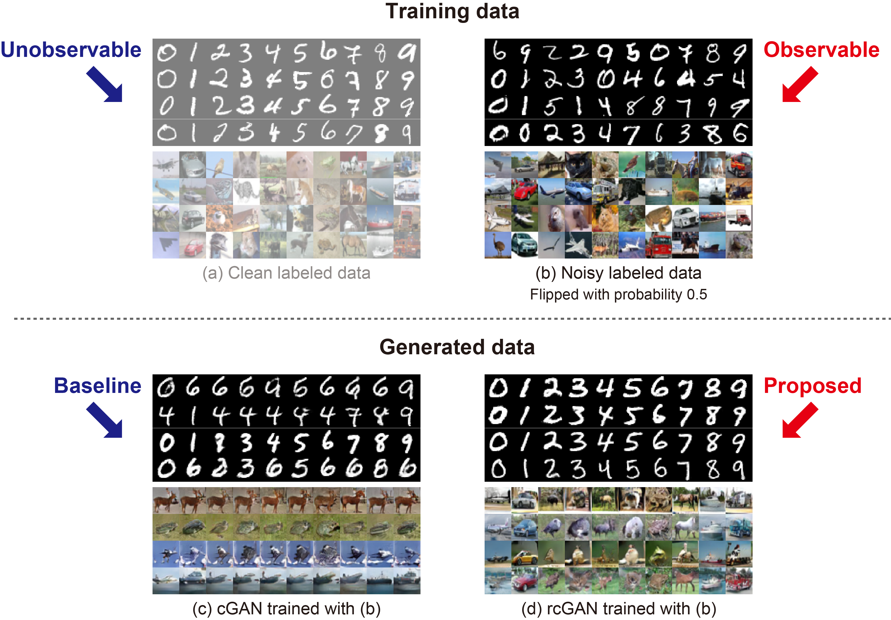
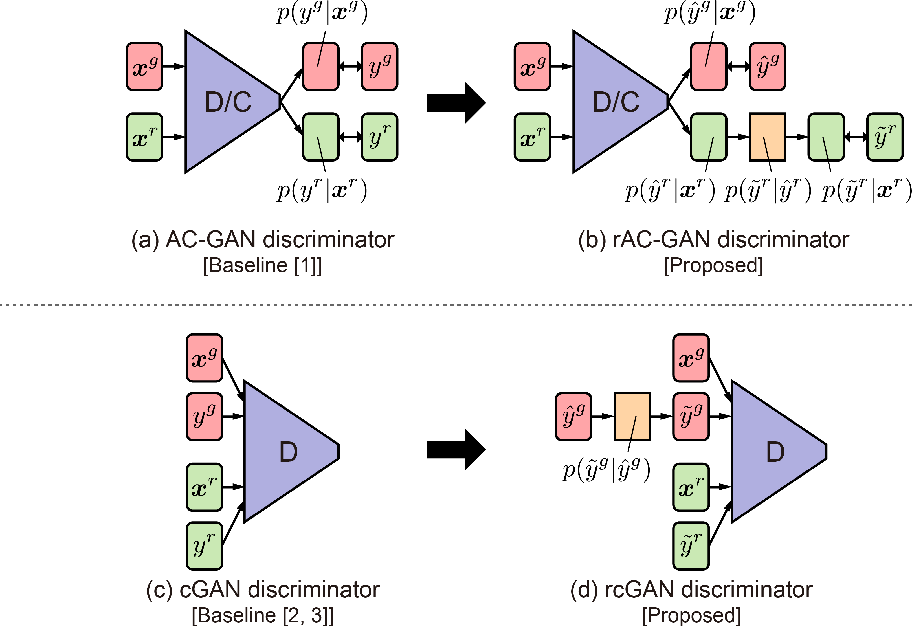
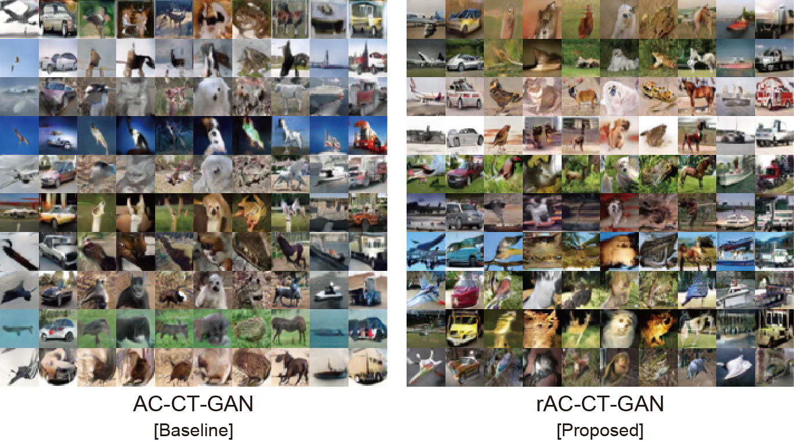
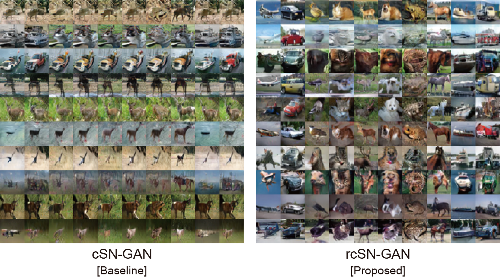

# rGAN: Label-Noise Robust Generative Adversarial Networks (CVPR 2019)

This repository provides PyTorch implementation for [rGAN](https://arxiv.org/abs/1811.11165).
rGAN can learn a *label-noise robust conditional generator* that can generate an image conditioned on the *clean* label rather than conditioned on the *noisy* label even when the *noisy* labeled data are only available during the training.



**NOTE:**
In BMVC 2019, we propose **classifier's posterior GAN** ([**CP-GAN**](https://arxiv.org/abs/1811.11163)) [5], which is another conditional extension of GAN for *class-overlapping* data. Check it from [**HERE**](https://takuhirok.github.io/CP-GAN/)!

## Paper

Label-Noise Robust Generative Adversarial Networks.<br>
[Takuhiro Kaneko](http://www.kecl.ntt.co.jp/people/kaneko.takuhiro/), [Yoshitaka Ushiku](https://yoshitakaushiku.net/), and [Tatsuya Harada](https://www.mi.t.u-tokyo.ac.jp/harada/).<br>
In CVPR 2019 (Oral).

[[Paper]](https://arxiv.org/abs/1811.11165)
[[Project]](https://takuhirok.github.io/rGAN/)
[[Slides]](docs/rGAN_slides.pdf)
[[Poster]](docs/rGAN_poster.pdf)
[[Talk]](https://www.youtube.com/watch?v=9GR8V-VR4Qg&t=5300s)

## Overview

Our task is, when given *noisy* labeled data, to construct a label-noise robust conditional generator that can generate an image conditioned on the *clean* label rather than conditioned on the *noisy* label. Our main idea for solving this problem is to incorporate a **noise transition model** (viewed as orange rectangles in (b) and (d); which represents a probability that a clean label is corrupted to a noisy label) into typical class conditional GANs. In particular, we develop two variants: **rAC-GAN** (b) and **rcGAN** (d) that are extensions of AC-GAN \[1] (a) and cGAN \[2, 3] (c), respectively.



## Installation

Clone this repository.

```bash
git clone https://github.com/takuhirok/rGAN.git
cd rGAN/
```
First install Python 3.6 and then install [PyTorch](https://pytorch.org/) 1.0 and the other dependencies by

```bash
pip install -r requirements.txt
```

## Train

To train the model, use the following script.

```bash
bash ./scripts/train.sh \
	[acgan/racgan/cgan/rcgan] [sngan/wgangp/ctgan] [cifar10/cifar100] \
	[symmetric/asymmetric] [0/0.1/0.3/0.5/0.7/0.9] output_directory_path
```

Please choose one of the options in the square brackets ([ ]).

### Example 1
To train rcSN-GAN (**rcGAN** + **SN-GAN**) on **CIFAR-10** in the **symmetric** noise with a noise rate **0.5**, run the following script.

```bash
bash ./scripts/train.sh rcgan sngan cifar10 symmetric 0.5 outputs
```

### Example 2
To train rAC-CT-GAN (**rAC-GAN** + **CT-GAN**) on **CIFAR-100** in the **asymmetric** noise with a noise rate **0.7**, run the following script.

```bash
bash ./scripts/train.sh racgan ctgan cifar100 asymmetric 0.7 outputs
```

## Test
To generate images, use the following script.

```bash
python test.py --g_path trained_model_path --out output_directory_path
```

### Example

```bash
python test.py --g_path outputs/netG_iter_100000.pth --out samples
```

**NOTE:**
In our paper, we conducted early stopping based on the FID because some models collapsed before the end of the training.

## Samples
### CIFAR-10 (symmetric noise with a noise rate of 0.5)

In each picture block, each column shows samples associated with the same class: *airplane*, *automobile*, *bird*, *cat*, *deer*, *dog*, *frog*, *horse*, *ship*, and *truck*, respectively, from left to right. Each row includes samples generated from a fixed ***z*** and a varied *y<sup>g</sup>*.





## Citation
If you use this code for your research, please cite our paper.

```
@inproceedings{kaneko2019rGAN,
  title={Label-Noise Robust Generative Adversarial Networks},
  author={Kaneko, Takuhiro and Ushiku, Yoshitaka and Harada, Tatsuya},
  booktitle={Proceedings of the IEEE Conference on Computer Vision and Pattern Recognition},
  year={2019}
}
```

## Related work

**NOTE:**
Kiran Koshy Thekumparampil, Ashish Khetan, Zinan Lin, and Sewoong Oh published a paper [4] independently from us on the same problem. They use similar ideas as our work, albeit with a different architecture. You should also check out their awesome work at [https://arxiv.org/abs/1811.03205](https://arxiv.org/abs/1811.03205).

1. A. Odena, C. Olah, and J. Shlens. Conditional image synthesis with auxiliary classifier GANs. In ICML, 2017. [[Paper]](https://arxiv.org/abs/1610.09585)
2. M. Mirza and S. Osindero. Conditional generative adversarial nets. arXiv preprint arXiv:1411.1784, 2014. [[Paper]](https://arxiv.org/abs/1411.1784)
3. T. Miyato and M. Koyama. cGANs with projection discriminator. In ICLR, 2018. [[Paper]](https://arxiv.org/abs/1802.05637)
4. K. K. Thekumparampil, A. Khetan, Z. Lin, and S. Oh. Robustness of Conditional GANs to Noisy Labels. In NeurIPS 2018. [[Paper]](https://arxiv.org/abs/1811.03205)
5. T. Kaneko, Y. Ushiku, T. Harada. Class-Distinct and Class-Mutual Image Generation with GANs [[Paper]](https://arxiv.org/abs/1811.11163) [[Project]](https://takuhirok.github.io/CP-GAN/) [[Code]](https://github.com/takuhirok/CP-GAN/)